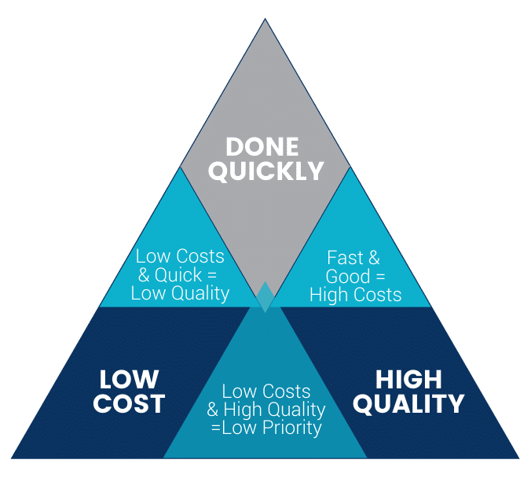
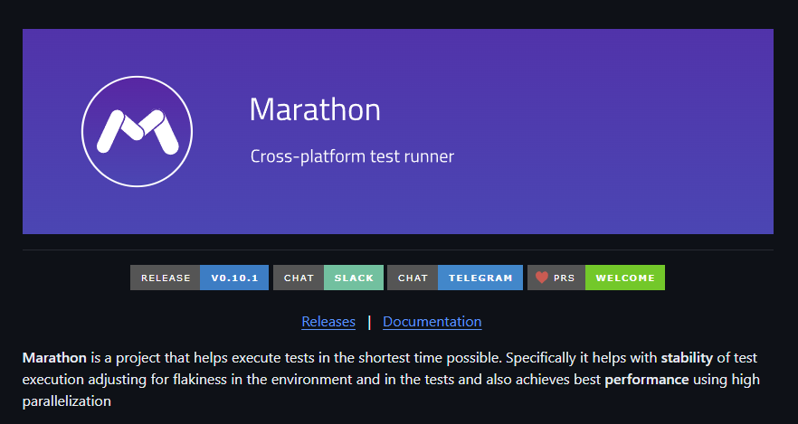
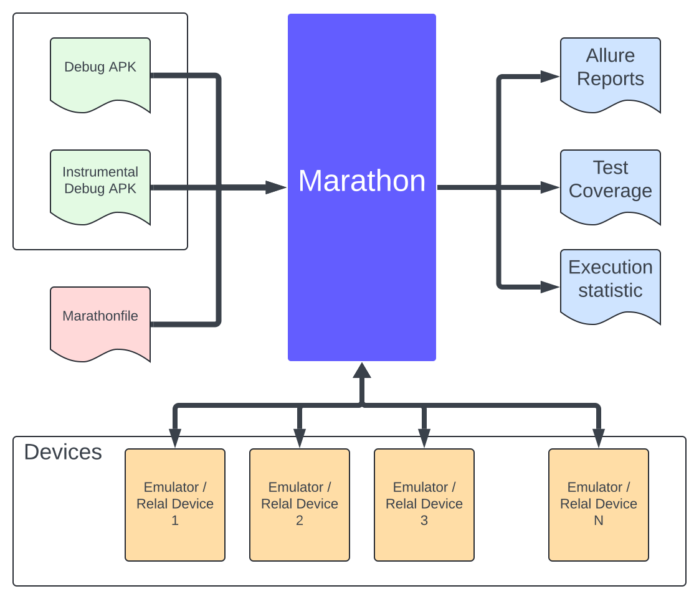
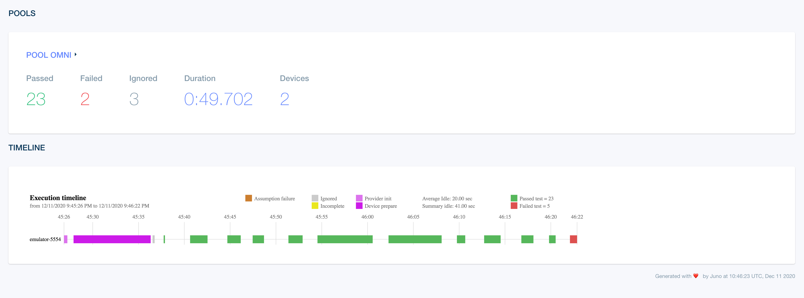
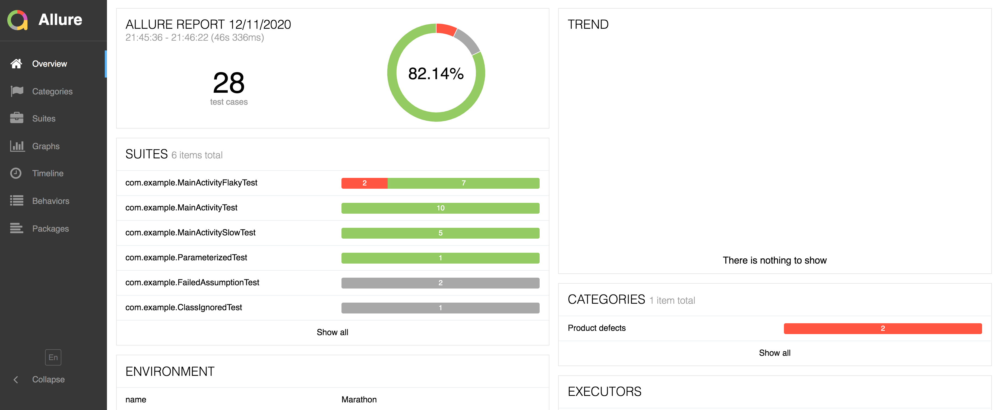
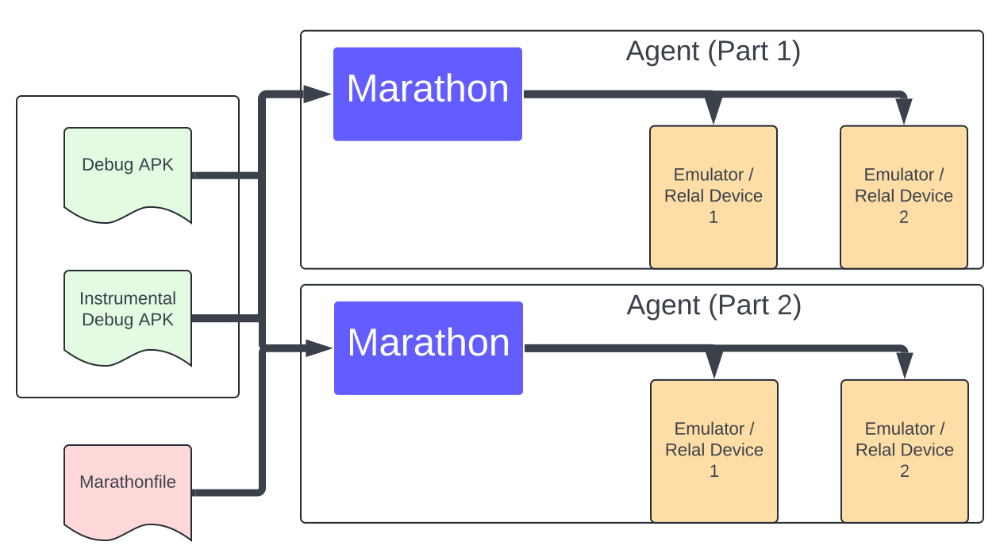

<style>
img[alt~="center"] {
  display: block;
  margin: 0 auto;
}
</style>

<!-- _class: lead -->

### Mobile instrumentation tests: Reliability, Scale and Support

###### Konstantin Aksenov

---

<!-- _class: lead -->


### Let's highlight the problem first

---

###  Storyline of UI tests in project

- Your team (Probably QA) decides to move from **Manual** UI feature testing to **Instrumentation**
- After some time you reach 100 UI tests in project, and from time to time **Local** execution is not consistent anymore (_few random UI tests failing for some unknown reasons_) but you are ok with it (_rerun can help_)
- You decide to add a new CI check for Pull Request automation and run UI tests for every change (_100 UI tests taking about 5 minutes for each run, but every 10% percent of runs failing because of flakiness_)

---

###  Why are test runs flaky?

- Emulator or Device hardware issues
- Connectivity issues
- Inconsistent responses from server
- Side effects in tests
- Many others...

---

###  Storyline of UI tests in project

- Team grows, you have around 20 developers for each platform, and about 1000 UI tests.
- Now you can't run UI tests for each Pull Request anymore, because almost each run fails (\*Simple math: Success rate for each tests 0.998 ^ 1000 = **13% Success\***).
- Developer complains about execution time. Each run takes **more than one hour**
- You need to find a solution...

---

###  Solutions

-  Run in Cloud
-  Run on Prem
-  Create subsets of tests _(PR / Nightly / Release)_

---

###  Run in Cloud

| Pros                                            | Cons                     |
| ----------------------------------------------- | ------------------------ |
| :white_check_mark: Easy to setup                | :x: Flexibility          |
| :white_check_mark: Can be scaled                | :x: You can pay too much |
| :white_check_mark: No maintenance required      |                          |
| :white_check_mark: Supports different platforms |                          |

---

###  Run in Cloud

Popular cloud platforms for UI tests

- Firebase Test Lab
- AppCenter
- Perfecto
- Marathon Cloud

---

###  Run on Prem

| Pros                                              | Cons                                         |
| ------------------------------------------------- | -------------------------------------------- |
| :white_check_mark: Flexibility                    | :x: Extra work on environment setup          |
| :white_check_mark: Can be much cheaper than Cloud | :x: Maintenance                              |
|                                                   | :x: Specific set of skills (_Mobile DevOps_) |

---

###  UI Test execution tradeoffs



---

###  Test runner: Why we need it?

##### Change **balance** between Speed, Quality and Cost parameters


---

###  Test runner: What is it?

Definition: _Test Runner is a **state machine** that can **analyse output** from test execution_

---

###  Test runner: Core functionality

- **Stability**: Strategies for flakiness control (retries)
- **Scalability**: Run in parallel on multiple devices or agents
- **Application management**: Install/Reinstall Application
- **Filtering**: Execute only preselected subset of tests
- **Batching**: Combine tests in batches for performed execution
- **Resource management**: Upload and download resources from device
- **Reporting**: Good-looking execution reports

---

<!-- _class: lead -->



---

###  Marathon

###### _Cross-platform test runner_

Supported platforms:

- Android
- iOS
- Flutter _(Cloud)_
- Appium _(Cloud)_

---

###  Marathon Overview



---

###  Marathon: How to start

Install CLI tooling

_MacOS_

```
brew tap malinskiy/tap
brew install malinskiy/tap/marathon-cloud
```

_Linux_
Install from Marathon Release binaries

---

###  Marathon: Quick Start (Android)

```yaml
name: "My awesome tests"
outputDir: "marathon"
debug: false
vendorConfiguration:
  type: "Android"
  applicationApk: "dist/app-debug.apk"
  testApplicationApk: "dist/app-debug-androidTest.apk"
```

---

###  Marathon: Quick Start (IOS)

```yaml
name: "My application"
outputDir: "derived-data/Marathon"
vendorConfiguration:
  type: "iOS"
  bundle:
    application: "sample.app"
    testApplication: "sampleUITests.xctest"
    testType: xcuitest
```

---

###  Marathon: Execute!

```bash
foo@bar:~$ marathon
00% | [omni]-[127.0.0.1:5037:emulator-5554] com.example.AdbActivityTest#testUnsafeAccess started
03% | [omni]-[127.0.0.1:5037:emulator-5554] com.example.AdbActivityTest#testUnsafeAccess failed
03% | [omni]-[127.0.0.1:5037:emulator-5554] com.example.ScreenshotTest#testScreencapture started
05% | [omni]-[127.0.0.1:5037:emulator-5554] com.example.ScreenshotTest#testScreencapture failed
05% | [omni]-[127.0.0.1:5037:emulator-5554] com.example.ParameterizedTest#test[0] started
08% | [omni]-[127.0.0.1:5037:emulator-5554] com.example.ParameterizedTest#test[0] ended
...

```

---

###  Marathon: Analyse the results

```bash
foo@bar:~$ marathon
...
...
...
Marathon run finished:
Device pool omni:
        22 passed, 15 failed, 3 ignored tests
        Failed tests:
                com.example.MainActivityFlakyTest#testTextFlaky
                ...
        Flakiness overhead: 1849ms
        Raw: 22 passed, 15 failed, 3 ignored, 6 incomplete tests
                com.example.MainActivityFlakyTest#testTextFlaky failed 1 time(s)
        Incomplete tests:
                com.example.BeforeTestFailureTest#testThatWillNotSeeTheLightOfDay incomplete 3 time(s)
Total time: 0H 1m 45s
Marathon execution failed
```

---

###  Marathon reports



---

###  Marathon Allure reports



---

###  Customize your strategy: Filtering

- "fully-qualified-test-name"
- "fully-qualified-class-name"
- "simple-test-name"
- "simple-class-name"
- "package"
- "method"
- "annotation"

---

###  Customize your strategy: Batching

- Isolate batching
- Fixed size batching

```yaml
batchingStrategy:
  type: "fixed-size"
  size: 5
  durationMillis: 100000
  percentile: 80.0
  timeLimit: "-PT1H"
  lastMileLength: 10
```

- Test class batching

---

###  Customize your strategy: Retries

- No Retries
- Fixed quota retry strategy

```yaml
retryStrategy:
  type: "fixed-quota"
  totalAllowedRetryQuota: 100
  retryPerTestQuota: 3
```

---

###  Customize your strategy: Dynamic configuration

`Marathonfile` support environment variable interpolation

```yaml
filteringConfiguration:
  allowlist:
    - type: "fragmentation"
      index: ${MARATHON_FRAGMENT_INDEX}
      count: 10
```

and then execute the testing as following:

```bash
foo@bar:~$ MARATHON_FRAGMENT_INDEX=0 marathon
```

---

###  Scale CI/CD: No test farm needed



---

<!-- _class: lead -->


### Q/A
